# docker_flask_test
This project is a simple demonstration of how to containerize a Flask application using Docker. It aims to provide a practical example of deploying a minimal Flask web app inside a Docker container for testing and development purposes.


This project demonstrates how to set up a basic Flask web application using `pipenv` for virtual environment and dependency management.

## Project Setup

### 1. Create Project Directory
-Create folder `flask_test`
-Go to directory of project ->pipenv install

```bash
mkdir flask_test
flask_test -> pipenv install
```


### Pipenv Installation

When you run the `pipenv install` command, Pipenv will automatically generate the `Pipfile.lock` file.

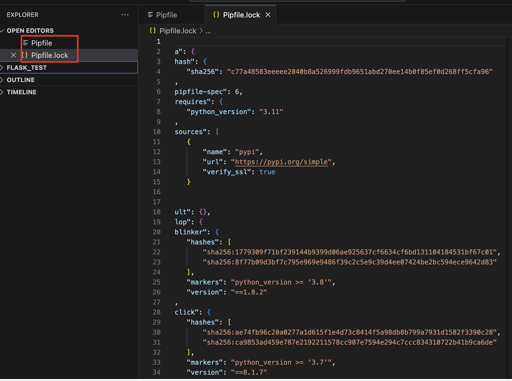

### Pipenv Commands

To activate the virtual environment:

```bash
pipenv shell
```

### Install development pandas dependency
```bash
pipenv install -dev pandas
```
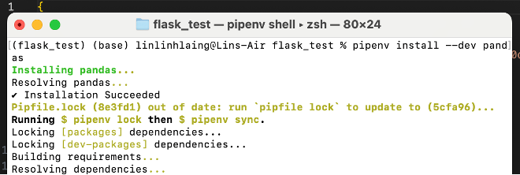

### Install Flask depencency
```bash
pipenv install -dev flask
```
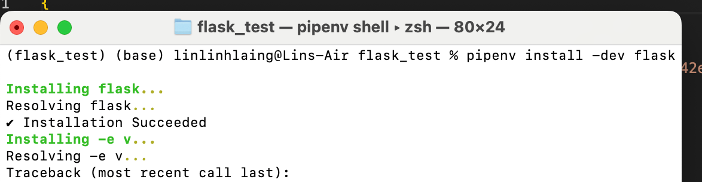

#### When you check the file, you can see the installed dependencies in the Pipfile and Pipfile.lock files
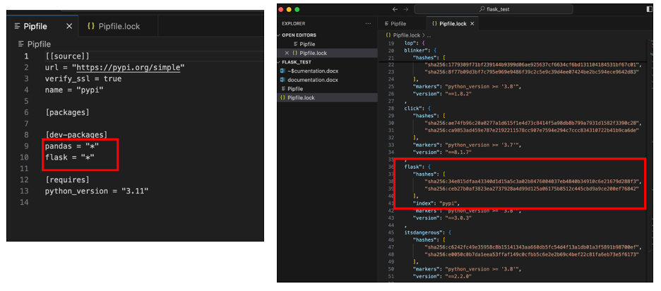

### Create a main.py for testing.
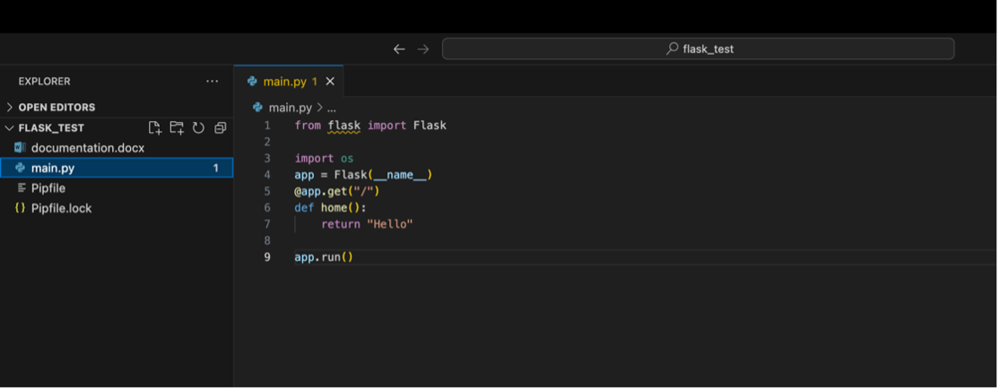

### Run the file.

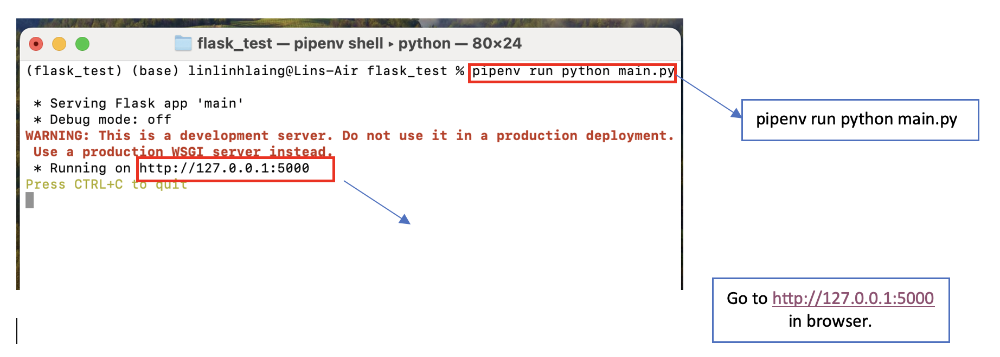
&nbsp;&nbsp;&nbsp;&nbsp;

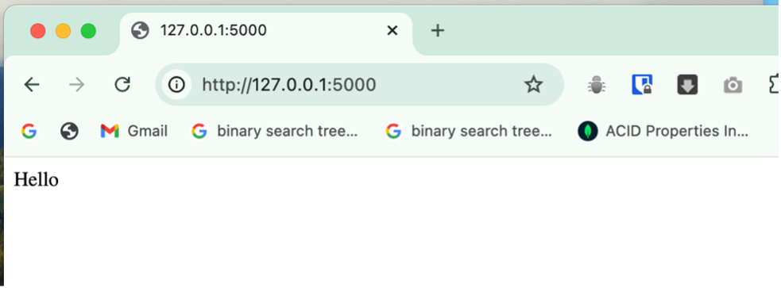


## Using `python-dotenv` for Environment Variables

`python-dotenv` is a Python library that allows you to load environment variables from a `.env` file into your Python project's environment. 

This is especially useful for managing sensitive configuration settings like API keys, database credentials, and environment-specific variables without hardcoding them into your code.

### Installation

To install `python-dotenv`

```bash
pipenv install --dev python-dotenv
```

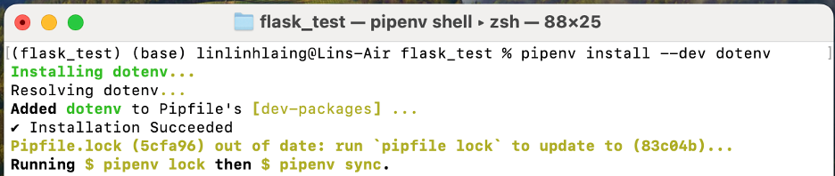

### Create .env file and set up variable
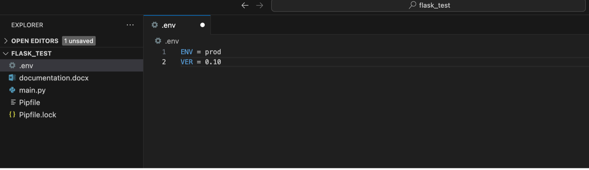

### To check the environment varible, create test.ipynb.
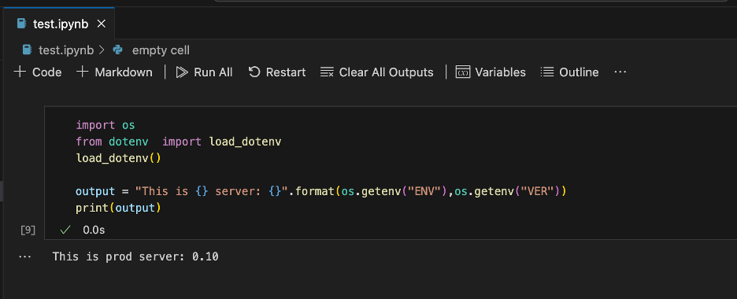

### Update main.py and run.
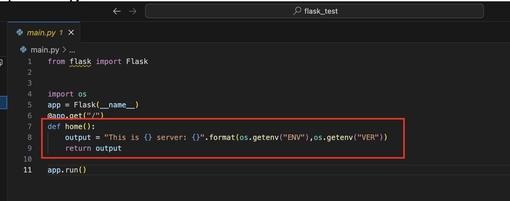

&nbsp;&nbsp;&nbsp;&nbsp;
&nbsp;&nbsp;&nbsp;&nbsp;

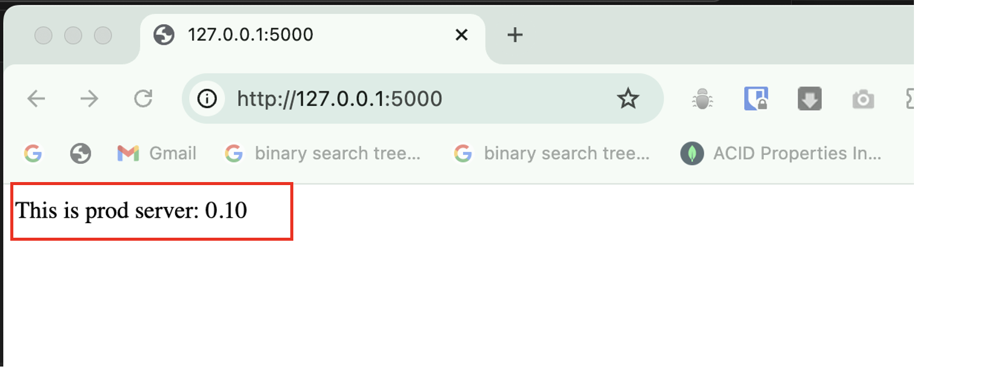