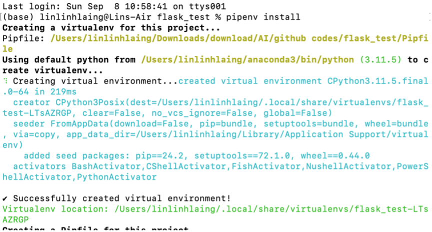

# docker_flask_test
This project is a simple demonstration of how to containerize a Flask application using Docker. It aims to provide a practical example of deploying a minimal Flask web app inside a Docker container for testing and development purposes.


This project demonstrates how to set up a basic Flask web application using `pipenv` for virtual environment and dependency management.

## Project Setup

### 1. Create Project Directory
-Create folder `flask_test`
-Go to directory of project ->pipenv install

```bash
mkdir flask_test
flask_test -> pipenv install





